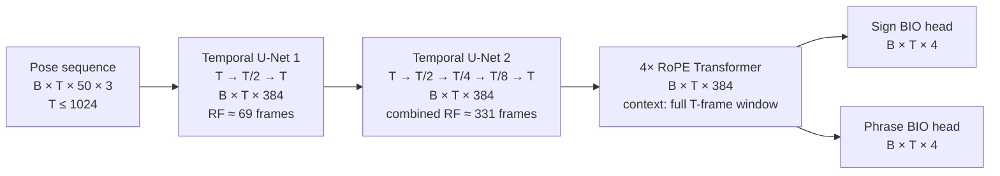

# Experiments

Training and finetuning. [`../benchmark/`](../benchmark/) stays inference-only on published checkpoints; anything with a training loop lives here.

## Basic model

The two temporal U-Nets learn progressively wider local motion patterns while restoring the original frame rate after each block. Together they give each frame an approximately 331-frame receptive field (about 6.6 seconds at 50 fps). The Transformer then relates every frame to the complete training window. Both heads retain the original temporal resolution and predict one BIO distribution per input frame. Full validation and test videos are processed as independent 1024-frame Transformer chunks.

## Rules

The [benchmarking rules](../benchmark/README.md#rules) apply unchanged: one evaluation protocol for every run, inherited from 2023. An experiment may change the *model*; it may not change how it is scored. Final numbers come from `benchmark/score.py` on the same DGS test clips, so an experiment row and a benchmark row are directly comparable.

Each run reports **dev** numbers here — test is for the final benchmark table only.

## What differs 2023 vs 2026, apart from the architecture

Read off both codebases (`v2023 src/` and `main sign_language_segmentation/`). This is the candidate list to ablate.

### Data and features

| | 2023 | 2026 |
|---|---|---|
| source | TFDS `holistic-25` build | raw `.pose` + `.eaf`, read directly |
| fps | fixed 25 | native 50 |
| pose cleanup | own `pose_utils.pose_hide_legs` — zeroes 8 leg points **and their confidences** | `preprocess_pose`: `pose_hide_legs` → `reduce_holistic` → `normalize_mean_std` (pose-anonymization) |
| face | dropped | dropped |
| extra features | E4 only: optical flow + 3D hand normalisation | velocity (fps-normalised), always on |
| model input | **75 joints x 3** (x, y, z). Body 33 + 21 + 21 hands: `pose_hide_legs` *zeroes* the 8 leg points but keeps them. E4 appends optical flow as a 4th channel | **50 joints x 6** (x, y, z + velocity). `reduce_holistic` *removes* the legs, leaving 8 body points — shoulders, elbows, wrists, hips — plus 21 + 21 hands, so 42 of 50 joints are hands |

### Labels

| | 2023 | 2026 |
|---|---|---|
| BIO ids | `O=0, B=1, I=2` | `UNK=0, O=1, B=2, I=3` |
| span → frames | `build_bio`: B on the first frame at or after the span start, then I **stopping one frame short** of the end. Compares in seconds | `create_bio_from_times` (what `fps_aug` selects): same start rule, but I **includes** the last frame at or before the end. Compares in milliseconds. Without `fps_aug` it is `create_bio`, which floors the start instead |
| phrase = | first gloss → last gloss | the `Deutsche_Übersetzung` tier's own bounds |
| clip set | keeps signer-videos with no glosses | drops them |
| split | TFDS split config | `splits.json`, extending `split.3.0.0-uzh-document` |

### Training

| | 2023 | 2026 |
|---|---|---|
| sampling | whole videos, no windowing | random 1024-frame windows |
| augmentation | **none** | `fps_aug` (25–50 random per clip, 5% tempo stretch), `frame_dropout` 0.15, `body_part_dropout` 0.1 |
| loss | NLL with **inverse class-frequency weights** per level | plain NLL + **Dice on the sign head** (weight 1.5) |
| loss masking | `(loss * mask).mean()` — scaled by mask density | `(loss * mask).sum() / mask.sum()` |
| optimiser | Adam, lr 1e-3, `ReduceLROnPlateau` | AdamW (wd 0.01), lr 5e-4, OneCycle |
| epochs / patience | 100 / 20 | 400–500 / 100 |

### Inference and scoring

| | 2023 | 2026 |
|---|---|---|
| decoding | thresholds `b`/`o`, tuned per level on dev | argmax (`likeliest`) |
| long clips | whole sequence in one pass | chunked at `num_frames` (1024) |
| selection metric | dev loss, early stopping | harmonic mean of sign and phrase IoU |
| reported | frame F1, IoU, % | IoU only |

## Ablations on the Public DGS Corpus

Filled in as runs land. **Validation numbers**, scored by `benchmark/score.py` through the same protocol the benchmark uses. Ablations stay on dev.

The 2026 shipped checkpoint is the reference, not a row we produced.

| | | Sign | | | | | Phrase | | | | |
|---|---|---|---|---|---|---|---|---|---|---|---|
| **Run** | **Change** | **F1-ma** | **F1-mi** | **IoU** | **%** | **mF1S** | **F1-ma** | **F1-mi** | **IoU** | **%** | **mF1S** |
| *— baselines —* | | | | | | | | | | | |
| 2026 shipped | reference | **0.525** | **0.812** | **0.610** | **0.974** | **0.495** | 0.476 | 0.888 | 0.793 | 0.553 | 0.051 |
| `00_2026_baseline` | all tricks on, batch 32, lr 1e-3 | 0.510 | 0.800 | 0.598 | 1.067 | 0.465 | **0.515** | **0.905** | **0.822** | **0.744** | **0.204** |
| *— learning-rate sweep —* | | | | | | | | | | | |
| `01_basic_lr1e-2` | all tricks off, batch 64 | 0.450 | 0.746 | 0.430 | 1.356 | 0.230 | 0.513 | 0.892 | 0.787 | 2.082 | 0.106 |
| `01_basic_lr3e-3` | " | 0.476 | 0.768 | 0.485 | 1.100 | 0.335 | 0.526 | 0.904 | 0.821 | 0.878 | 0.176 |
| `01_basic_lr1e-3` | " | **0.519** | **0.813** | **0.587** | 1.121 | **0.464** | 0.544 | **0.911** | **0.831** | 1.080 | 0.286 |
| `01_basic_lr5e-4` | " | 0.515 | 0.805 | 0.566 | 1.035 | 0.430 | **0.545** | 0.905 | 0.823 | 1.280 | **0.333** |
| `01_basic_lr3e-4` | " | 0.511 | 0.803 | 0.573 | 1.026 | 0.453 | 0.540 | 0.907 | 0.828 | 1.036 | 0.308 |
| `01_basic_lr1e-4` | " | 0.502 | 0.796 | 0.538 | **1.022** | 0.416 | 0.542 | 0.904 | 0.812 | 1.108 | 0.310 |
| `01_basic_lr3e-5` | " | 0.487 | 0.774 | 0.524 | 1.058 | 0.352 | 0.531 | 0.907 | 0.819 | 0.805 | 0.185 |
| `01_basic_lr1e-5` | " | 0.464 | 0.748 | 0.471 | 1.264 | 0.234 | 0.525 | 0.902 | 0.812 | **0.981** | 0.148 |
| `01_basic_lr3e-6` | " | 0.063 | 0.076 | 0.346 | 9.619 | 0.065 | 0.197 | 0.436 | 0.036 | 8.351 | 0.000 |
| `01_basic_lr1e-6` | " | 0.038 | 0.047 | 0.351 | 3.000 | 0.053 | 0.199 | 0.436 | 0.043 | 10.217 | 0.000 |

Bold marks the best within each group; `%` is best nearest **1**. Predictions live in `experiments/predictions/` (dev), kept apart from `benchmark/predictions/` (test) so the two can never be scored together.

### Baselines

The 2026 shipped checkpoint against the same architecture trained by us — all tricks on, batch 32, lr 1e-3, 500 epochs, no hyperparameter search, selected on `validation_mean_mf1s` rather than IoU.

**The two split perfectly by level**: shipped takes every Sign column, ours takes every Phrase column. Phrase `%` goes 0.553 → 0.744 and phrase mF1S 0.051 → 0.204, while sign IoU slips 0.610 → 0.598. Which half of that is the selection metric and which is our training is not yet separated — that needs a run selected on `hm_iou` under otherwise identical settings.

### Learning-rate sweep

Ten runs differing only in learning rate, spanning four decades. Every trick is off — dice loss, all three dropouts and velocity — leaving `fps_aug` on, at batch 64 with `adamw-onecycle`, 500 epochs and patience 50. None hit the 5-hour cap; runtimes ran 21 min (lr 1e-2, best epoch 20) to 4h14m (lr 1e-5, best epoch 482).

**The optimum is inside the range and broad.** By the selection metric, mean of sign and phrase mF1S: 5e-4 gives 0.382, 3e-4 gives 0.381, 1e-3 gives 0.375. Those three are a plateau, not a ranking — with no seed replicates a 0.007 spread is not a result. Both tails fall away monotonically, so no wider sweep is needed.

Within the plateau the metrics disagree, in a way worth keeping: **1e-3** leads IoU (hm 0.688) while **3e-4** emits close to the right number of segments at both levels (sign `%` 1.026, phrase `%` 1.036), which is what mF1S rewards and IoU cannot see. **5e-4** tops mean mF1S but over-segments phrases (`%` 1.280), so its lead rests on a metric its own `%` column undercuts.

At 3e-6 and below the model never improved past its first validation — best epoch 1, phrase mF1S 0.000, and eight to ten times too many phrase segments. Those two rows bracket the sweep rather than measure a learning rate.

## Pretraining on YouTube

Stage one of the staged design borrowed from [Segment Any Text](../literature/segment-any-text/) — weak, plentiful labels first, precise and scarce ones after. Subtitle timings stand in for their newline-derived boundaries: no alignment step, no filtering for subtitle quality, straight to BIO. The [ACL SRW paper](../literature/2025-temporal-boundary-identification/) shows that recipe trains.

**Phrase level only.** A subtitle cue is a translation unit, not a sign, so this stage can supervise the phrase head and nothing else. The sign head has no signal here.

### The data

`/shares/iict-sp2.ebling.cl.uzh/common/YouTube-SL-25_VGG` — 2.8 TB.

| | |
|---|---|
| pose files | 38,857 `.pose`, MediaPipe Holistic |
| subtitle files | 38,878 `.vtt` |
| estimated duration | **~3,700 hours** (median 3.8 min, mean 5.7 min, max 49 min per video) |
| estimated cues | **~2.4M** (median 33 per video, median cue 4.3 s) |
| subtitle languages | en 16,110, ase 3,357, hu 1,685, pl 1,583, ja 1,063, de 1,002, fr 921, it 882, es 812, ru 706, … |

For scale: DGS train is 91 hours and 61k phrases, so this is **~40x the hours** and **~40x the phrase-level units**.

### Runs

| # | run | change | phrase F1-ma | phrase IoU | phrase % | phrase mF1S |
|---|---|---|---|---|---|---|
| — | Seq2Seq + attention (ACL SRW 2025)\* | reference | 0.60 | 0.62 | 0.95 | — |
| | | _(nothing yet)_ | | | | |

\* Their best YouTube-ASL row, Table 3 ([notes](../literature/2025-temporal-boundary-identification/)), scored on **their** YouTube-ASL split, not ours: ASL alone against our 56 languages, ResNet-101 over RGB and optical flow against MediaPipe pose, and their own decoding. Not a like-for-like score, but the only published point on subtitle-supervised YouTube segmentation.
