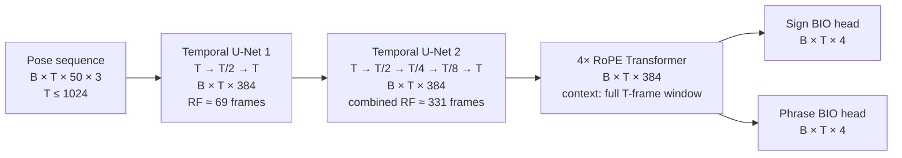

# Experiments

Training and finetuning. [`../benchmark/`](../benchmark/) stays inference-only on
published checkpoints; anything with a training loop lives here.

## Basic model

The two temporal U-Nets learn progressively wider local motion patterns while
restoring the original frame rate after each block. Together they give each
frame an approximately 331-frame receptive field (about 6.6 seconds at 50 fps).
The Transformer then relates every frame to the complete training window. Both
heads retain the original temporal resolution and predict one BIO distribution
per input frame. Full validation and test videos are processed as independent
1024-frame Transformer chunks.

## Rules

The [benchmarking rules](../benchmark/README.md#rules) apply unchanged: one
evaluation protocol for every run, inherited from 2023. An experiment may change
the *model*; it may not change how it is scored. Final numbers come from
`benchmark/score.py` on the same DGS test clips, so an experiment row and a
benchmark row are directly comparable.

Each run also reports **dev** numbers — test is for the final table only.

## What differs, apart from the architecture

Read off both codebases (`v2023 src/` and `main sign_language_segmentation/`).
This is the candidate list to ablate — the architecture swap is deliberately not
in it.

### Data and features

| | 2023 | 2026 |
|---|---|---|
| source | TFDS `holistic-25` build | raw `.pose` + `.eaf`, read directly |
| fps | fixed 25 | native 50 |
| pose cleanup | own `pose_utils.pose_hide_legs` — zeroes 8 leg points **and their confidences** | `preprocess_pose`: `pose_hide_legs` → `reduce_holistic` → `normalize_mean_std` (pose-anonymization) |
| face | dropped | dropped |
| extra features | E4 only: optical flow + 3D hand normalisation | velocity (fps-normalised), always on |
| input | 3 components, xyz | 50 joints × 6 dims |

### Labels

| | 2023 | 2026 |
|---|---|---|
| BIO ids | `O=0, B=1, I=2` | `UNK=0, O=1, B=2, I=3` |
| span → frames | `build_bio` walk for training/frame metrics; `floor`/`floor` inclusive for segment metrics | `create_bio` (floor/ceil), or `create_bio_from_times` (searchsorted on timestamps) when `fps_aug` |
| phrase = | first gloss → last gloss | the `Deutsche_Übersetzung` tier's own bounds |
| clip set | keeps signer-videos with no glosses | drops them |
| split | TFDS split config | `splits.json`, extending `split.3.0.0-uzh-document` |

### Training

| | 2023 | 2026 |
|---|---|---|
| sampling | whole videos, no windowing | random 1024-frame windows |
| augmentation | **none** | `fps_aug` (25–50 random per clip, 5% tempo stretch), `frame_dropout` 0.15, `body_part_dropout` 0.1 |
| loss | NLL with **inverse class-frequency weights** per level | plain NLL + **Dice on the sign head** (weight 1.5) |
| loss masking | `(loss * mask).mean()` — scaled by mask density | `(loss * mask).sum() / mask.sum()` |
| optimiser | Adam, lr 1e-3, `ReduceLROnPlateau` | AdamW (wd 0.01), lr 5e-4, OneCycle |
| epochs / patience | 100 / 20 | 400–500 / 100 |

### Inference and scoring

| | 2023 | 2026 |
|---|---|---|
| decoding | thresholds `b`/`o`, tuned per level on dev | argmax (`likeliest`) |
| long clips | whole sequence in one pass | chunked at `num_frames` (1024) |
| selection metric | dev loss, early stopping | harmonic mean of sign and phrase IoU |
| reported | frame F1, IoU, % | IoU only |

Roughly ordered by expected effect from the 2026 README's own account: `fps_aug`
is called essential (0.58→0.49 without it), `frame_dropout` essential, Dice worth
+2pp sign IoU, velocity +1–2pp. Those are its numbers against its own baseline,
not ours — establishing them against a common baseline is the point of this
directory.

## Ablations

Filled in as runs land. **Validation numbers**, scored by `benchmark/score.py`
through the same protocol the benchmark uses. Ablations stay on dev: test is for
the single model finally reported, and looking at it once per experiment would
leak it into model selection.

The 2026 shipped checkpoint is the reference, not a row we produced.

| | | Sign | | | | | Phrase | | | | |
|---|---|---|---|---|---|---|---|---|---|---|---|
| **Run** | **Change** | **F1-ma** | **F1-mi** | **IoU** | **%** | **mF1S** | **F1-ma** | **F1-mi** | **IoU** | **%** | **mF1S** |
| 2026 shipped | reference | 0.525 | 0.812 | 0.610 | 0.974 | 0.495 | 0.476 | 0.888 | 0.793 | 0.553 | 0.051 |
| `00_2026_baseline` | all tricks on, batch 32, lr 1e-3 | 0.510 | 0.800 | 0.598 | 1.067 | 0.465 | 0.515 | 0.905 | 0.822 | 0.744 | 0.204 |
| `01_basic_lr1e-2` | all tricks off, batch 64 | 0.450 | 0.746 | 0.430 | 1.356 | 0.230 | 0.513 | 0.892 | 0.787 | 2.082 | 0.106 |
| `01_basic_lr3e-3` | " | 0.476 | 0.768 | 0.485 | 1.100 | 0.335 | 0.526 | 0.904 | 0.821 | 0.878 | 0.176 |
| `01_basic_lr1e-3` | " | 0.519 | 0.813 | 0.587 | 1.121 | 0.464 | 0.544 | 0.911 | 0.831 | 1.080 | 0.286 |
| `01_basic_lr5e-4` | " | 0.515 | 0.805 | 0.566 | 1.035 | 0.430 | 0.545 | 0.905 | 0.823 | 1.280 | 0.333 |
| `01_basic_lr3e-4` | " | 0.511 | 0.803 | 0.573 | 1.026 | 0.453 | 0.540 | 0.907 | 0.828 | 1.036 | 0.308 |
| `01_basic_lr1e-4` | " | 0.502 | 0.796 | 0.538 | 1.022 | 0.416 | 0.542 | 0.904 | 0.812 | 1.108 | 0.310 |
| `01_basic_lr3e-5` | " | 0.487 | 0.774 | 0.524 | 1.058 | 0.352 | 0.531 | 0.907 | 0.819 | 0.805 | 0.185 |
| `01_basic_lr1e-5` | " | 0.464 | 0.748 | 0.471 | 1.264 | 0.234 | 0.525 | 0.902 | 0.812 | 0.981 | 0.148 |
| `01_basic_lr3e-6` | " | 0.063 | 0.076 | 0.346 | 9.619 | 0.065 | 0.197 | 0.436 | 0.036 | 8.351 | 0.000 |
| `01_basic_lr1e-6` | " | 0.038 | 0.047 | 0.351 | 3.000 | 0.053 | 0.199 | 0.436 | 0.043 | 10.217 | 0.000 |

"All tricks" is dice loss, the three dropouts, and velocity; `fps_aug` is on
throughout. Every `01_basic` run is identical apart from the learning rate: from
scratch, 500 epochs, patience 50, batch 64, `adamw-onecycle`, selected on
`validation_mean_mf1s`. None hit the 5-hour cap; runtimes ran 21 min (lr 1e-2,
best epoch 20) to 4h14m (lr 1e-5, best epoch 482).

Ranked by the selection metric, mean of sign and phrase mF1S:

| lr | mean mF1S | hm IoU | sign % | phrase % |
|---|---|---|---|---|
| 5e-4 | **0.382** | 0.671 | 1.035 | 1.280 |
| 3e-4 | 0.381 | 0.677 | 1.026 | 1.036 |
| 1e-3 | 0.375 | **0.688** | 1.121 | 1.080 |
| 1e-4 | 0.363 | 0.648 | 1.022 | 1.108 |
| 3e-5 | 0.268 | 0.639 | 1.058 | 0.805 |
Predictions live in `experiments/predictions/` (dev), kept apart from
`benchmark/predictions/` (test) so the two can never be scored together.
